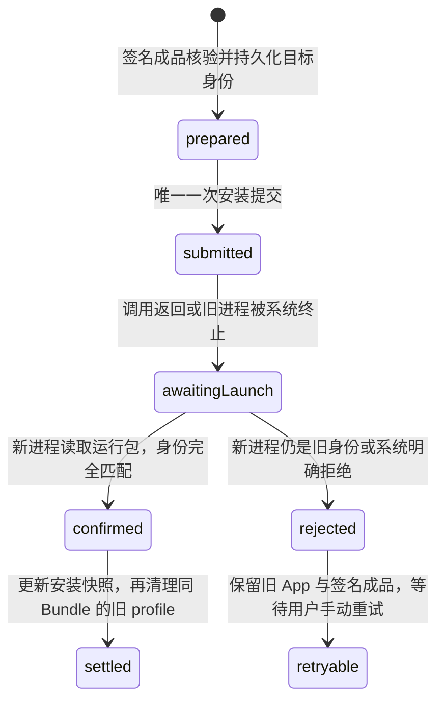

# Seal 全代码审计与收敛方案（2026-09-15）

## 1. 本轮结论

本轮只做文档清理与静态代码审计，没有修改 Swift、Rust、工程配置或 CI，也没有触发编译。

真机现象与当前代码可以形成一条明确的故障链：

1. Seal 自更新安装函数在一次用户操作中最多安装两次。
2. 新包是否生效却由仍在运行的旧进程立即判断；这和项目已有的“只能由下次启动的新进程确认”规则冲突。
3. 如果旧进程判断未匹配，启动维护还会再自动发起一次后台覆盖安装。
4. 安装中进程被替换或终止时，数据库可能停留在 `pushing` / `verifying`，证书页只接受 `state == installed`，于是 Seal 不再显示为该证书的已安装 App。
5. 应用详情把“当前运行包身份”和“待安装签名成品身份”放在同一组字段中比较，因此可以显示“描述文件不匹配”，后续日期也可能被旧快照覆盖。

因此，下一轮代码修复的首要目标应是：**把 Seal 自续签改成一次提交、跨进程确认、一次结算的持久化事务；任何恢复逻辑都不得自动再次安装。**

文件 App 中 Seal 目录消失目前只能确认两点：签名包在安装前会检查两个文件共享键；第一方代码没有删除整个 `Documents` 目录。仅凭现有代码和截图不能证明是数据被删除，还是应用失效后 Files Provider 暂时隐藏容器。这个问题必须增加跨进程容器证据后再下最终结论。

---

## 2. 审计范围与方法

审计直接以当前源码为依据，没有使用已经删除的历史分析文档推断实现。

- Git 跟踪文件：629 个。
- 扫描的 Swift、Rust、Python、Shell、YAML 源码/配置：343 个文件。
- 第一方应用、扩展、测试、脚本、工作流和工具：约 42,634 行。
- `Vendor`：约 89,458 行，按集成边界、补丁点、许可证和重复内容扫描；不把完整上游源码重写纳入本项目重构范围。
- 类型声明扫描：30 个 actor、103 个 class、384 个 struct、247 个 enum、15 个 protocol。
- 第一方源码未发现内容完全相同的重复文件。
- 关键路径深读：账号与证书、签名工作区、签名协调、安装通道、自应用注册、跨进程接管、设备描述文件、应用记录、文件存储、日志、维护任务、主要 UI 展示和相关测试。

静态扫描的限制：Windows 本机不能编译 iOS 工程；本报告不把静态推导写成真机修复结论。下一轮代码修改必须由云 CI 编译和真机链路验收闭环。

---

## 3. 目录和文件：哪些必须保留

| 路径 | 结论 | 原因 |
|---|---|---|
| `.git/` | 必须保留 | 完整提交历史、分支和远端信息。 |
| `.github/` | 必须保留 | iOS 云编译、快速 IPA、测试和发布流程。 |
| `Config/` | 必须保留 | 工程构建配置。 |
| `Scripts/` | 必须保留 | IPA 打包、RustBridge 一致性及发布安全校验。 |
| `Seal/` | 必须保留 | 主应用源码、资源、权限和业务实现。 |
| `SealTunnel/` | 必须保留 | LocalDevVPN 扩展。 |
| `SealTests/` | 必须保留 | 核心规则和回归测试；编译成功不能替代这些验证。 |
| `SealUITests/` | 必须保留 | UI 主链路回归。 |
| `Vendor/` | 必须保留 | 当前工程直接依赖的本地上游源码和预编译桥接产物。 |
| `Tools/` | 必须保留 | 配对辅助工具及其上游来源记录。 |
| `project.yml` | 必须保留 | Xcode 工程生成入口，包含 target、版本、权限和文件共享键。 |
| `.gitignore` / `.gitattributes` | 必须保留 | 忽略规则和跨平台文本规则。 |
| `LICENSE` | 必须保留 | 项目许可证。 |
| `Seal/Resources/ThirdPartyNotices.txt` | 必须保留 | App 内第三方许可声明。 |
| `AGENTS.md` | 必须保留 | 后续修复、验证和发布的项目硬约束。 |
| `RELEASE_NOTES.md` | 必须保留 | 发布工作流直接读取，删除会使发布正文步骤失败。 |
| `docs/` | 可删除 | 旧文档已删除后只剩空目录；Git 不跟踪空目录。 |
| `.dev-workspace/` | 非构建必需 | 已被 `.gitignore` 排除，项目源码和流程没有引用；其中是上游克隆、历史产物、截图和研究材料。可在需要释放本机空间时单独清理，但它不属于本次提交。 |

重复哈希检查发现的文件均有合理用途，例如不同上游库各自携带许可证、两个架构目录中的 `.gitkeep`、不同尺寸槽位复用同一 App 图标、App 与扩展使用相同 entitlement 内容。不能只因哈希相同删除。

---

## 4. 已证实的关键问题

### P0-1：一次 Seal 自续签会主动安装两次

**证据**：`Seal/Core/Signing/SigningCoordinator.swift:1254-1305`

代码使用 `for attempt in 1...2`。第一次 `installChannel.install` 返回后，如果当前进程读取的包身份没有同时满足条件，就重置通道并再次安装相同 IPA。这与用户观察到的“先显示可用，随后又自动重装”完全一致。

同一文件在 `1279-1294` 立即通过 `SelfAppMetadata.current()` 检查安装结果；但 `Seal/Core/Renewal/SelfSigningHandoffStore.swift:145-158` 明确规定：准备接管记录的同一进程只能得到 `.awaitingRestart`，必须由新进程确认。这是当前实现内部的直接矛盾。

**影响**：

- 同一 Bundle ID 上出现连续覆盖安装。
- 第一次安装可能仍在系统结算时，第二次已经重置通道并重新提交。
- 旧进程可能读到旧包、缓存视图或处于替换边界的文件，形成假失败。
- 描述文件、数据库状态和桌面可启动状态可能来自不同一次安装。

**必须改成**：一次用户续签只允许一次 `stageAndInstall`。提交前持久化目标身份；安装调用返回或旧进程被终止后都只记为“等待新进程确认”。新进程读取自身包内 `embedded.mobileprovision` 后完成最终结算。

### P0-2：启动维护仍会自动再次安装

**证据**：`Seal/Core/Renewal/SelfAppRegistrar.swift:144-179`

启动核验得到 `.profileMismatch` 后，代码领取一次恢复资格并调用 `pendingSelfReplacementRecovery()`，再次执行覆盖安装。持久化的一次性标记只能防止无限循环，不能阻止用户已经看到的第二次自动安装。

**必须改成**：启动维护只读、核验、结算和记录诊断；不得发起安装。若上次安装未生效，保留原 Seal 可用状态和已签名成品，向用户提供一次明确的手动重试入口。

### P0-3：自更新是进程终止边界，但状态模型按普通函数返回设计

**证据**：

- `SigningCoordinator.swift:355-378` 在安装前把新签名结果写入 AppRecord。
- `SigningCoordinator.swift:1247-1272` 在安装期间依次写入 `.pushing`、`.verifying`。
- `.installed` 和 `lastInstalledAt` 只在 `1314-1321` 保存。

成功覆盖 Seal 自身时，iOS 可以终止旧进程，最后一步未必有机会执行。于是系统里可能已有 App，而数据库仍停在中间状态。

**必须改成**：使用可恢复的持久化事务状态，而非依赖旧进程函数返回。



事务必须持久化：事务 ID、AppRecord ID、Bundle ID、Team ID、profile UUID、证书序列号、签名成品 SHA-256、提交次数、各阶段时间和最后一次系统错误。不得保存 Apple ID 明文、密码、会话或私钥。

### P0-4：证书页与已安装列表使用了两套“已安装”规则

**证据**：

- `Seal/Core/Signing/CertificateRevocationImpact.swift:33-43` 只接受 `app.state == .installed`，并只检查顶层 `certificateSerialNumber`。
- `Seal/Core/Apps/AppRecord.swift:261-263` 的已安装列表规则还接受 `isSeal`、`lastInstalledAt` 和 `signedArtifactStatus == .installed`。
- 同文件的 `associatedApps` 会检查 `signingTargets`，`affectedApps` 却不会。

自更新被终止在 `.pushing/.verifying` 时，Seal 仍显示在已安装列表，但证书页显示“本机已安装 App 暂无”。这和本次截图现象一致。

**必须改成**：建立唯一的证书关联查询。对于已安装 Seal，以当前运行包身份为最高优先级；其余 App 使用统一的 `belongsInInstalledList` 和已安装身份快照，同时检查主 App 与扩展 target。

### P0-5：应用详情比较了两个不同生命周期的身份

**证据**：`Seal/Features/Apps/AppPresentation.swift:141-183`

到期日、Team、Bundle ID 和顶层证书字段表示当前已安装快照，但比较对象 `signingTargets` 可能来自刚签好的待安装成品。`SelfAppRegistrar.swift:383-395` 又有意保留待安装 targets，同时用运行中的旧包纠正顶层字段。因此“描述文件不匹配”可以只是“旧运行包 vs 新候选包”，并非当前运行包内部不一致。

**必须改成**：把 AppRecord 的身份拆成两个明确对象：

- `installedIdentity`：设备当前实际运行/已安装包的 Bundle、Team、profile UUID、证书、有效期。
- `candidateIdentity`：本次签名成品准备安装的对应信息和 SHA-256。

详情页“描述文件”和有效期只展示 `installedIdentity`；候选包单独显示“等待安装/等待新进程确认”。

### P0-6：SelfAppRegistrar 长期持有启动时的旧 metadata

**证据**：

- `Seal/Application/AppContainer.swift:125` 创建 `SelfAppRegistrar` 时传入一次 `SelfAppMetadata.current()`。
- `Seal/Core/Renewal/SelfAppRegistrar.swift:20-37` 把它保存为常量。
- 后续 `ensureRegistered()` 和接管确认继续使用这份启动快照。

发生自替换或同一实例再次维护时，这份快照不能代表当时磁盘或运行包的最新状态。

**必须改成**：注入 `InstalledIdentityReader`，每次维护开始时获取一次新的不可变快照；同一轮事务内使用同一快照，下一轮重新读取。

---

## 5. Files 中 Seal 目录消失：已知与未知

### 已确认

- `project.yml:76-77` 为 Seal 主 App 配置了 `LSSupportsOpeningDocumentsInPlace = true` 和 `UIFileSharingEnabled = true`。
- `SigningCoordinator.swift:1214-1223` 在自更新安装前检查签名后的 IPA 仍保留这两个键。
- `SealLogStore` 将日志镜像到 `Documents/Seal-log.txt`。
- 全仓删除调用扫描没有发现删除整个 App `Documents` 根目录的第一方代码。
- `AppFileStore` 的清理范围主要是 `Documents/Apps/<AppRecord UUID>`、缓存、导出和暂存目录。
- `SelfAppRegistrar.swift:305-313` 会删除重复 Seal 记录对应的内部 App 文件夹，而且两个删除错误都被 `try?` 吞掉。

### 尚未证实

- Files 中目录消失究竟是容器内容被删除、容器标识发生变化、App 失效后系统隐藏文件提供入口，还是覆盖安装阶段的暂态。
- 本轮到底安装了哪个 profile UUID、系统 `profiled` 最终保留哪个 UUID。
- installd 第一次和第二次安装的开始、结束及拒绝顺序。

### 下一轮需要补的证据

1. App 首次启动时同步创建一个极小的 `Documents/Seal-container.json`，写入随机容器实例 ID、首次创建时间、当前 Bundle ID、版本和 profile UUID；不写账号明文或凭据。
2. 每次启动、签名前、安装提交前记录容器实例 ID和 Documents 路径的不可逆哈希。
3. 自更新事务记录签名 IPA 内的两个文件共享键、profile UUID、证书序列号、SHA-256。
4. 新进程确认时记录运行包内同一组字段，再和事务目标逐项比较。
5. 重复记录清理改为隔离，记录 AppRecord ID、相对路径、选择保留该记录的依据；不得静默删除。

启动时目前通过未等待的 `Task { await logStore.flush() }` 创建日志镜像。如果 App 很快进入自安装并被终止，这个任务不保证完成。容器标记和首条启动证据应在任何维护/安装任务之前可靠落盘。

---

## 6. 可合并和可优化的代码

### P1-1：收敛自更新逻辑为一个深模块

当前职责散落在 `SigningCoordinator`、`SelfSigningHandoffStore`、`SelfAppRegistrar`、`AppRecord` 展示字段、启动维护和安装通道中。建议新增一个 `SelfReplacementTransaction` 边界，由它独占：准备、唯一提交、跨进程确认、最终结算、旧 profile 清理和失败保留。

外部只需要三个接口：

```swift
prepare(signedArtifact:) -> Transaction
submit(transactionID:) async throws
reconcileAtLaunch() async -> ReconciliationResult
```

这能删除协调器中的二次安装循环、启动自动恢复闭包和多处临时状态判断。

### P1-2：合并设备描述文件枚举

`DeviceProfileInspector` 与 `DeviceProfileCleaner` 都在做：创建临时目录、misagent dump、枚举全部文件、CMS 解析、按 UUID 去重、清理临时目录。重复实现会让错误处理和统计逐渐分叉。

建议建立只读 `DeviceProfileRepository.snapshot()`，返回：解析成功的 profile、无法解析文件数、dump/目录错误和操作 ID。Inspector 只查询 snapshot；Cleaner 依据 snapshot 删除精确 UUID。删除策略仍保持“同 Bundle ID 且保留本次 UUID”。

### P1-3：合并安装入口、重试和错误分类

`MinimuxerInstallChannel` 有多组 `push/install/stageAndInstall` 重载，上传、超时、通道重置、ready 等待和重试循环重复。带进度与不带进度的合并安装也各维护一份几乎相同的流程。

同时 `installationFailure` 与 `isTerminalInstallError` 手工维护两套错误词表。当前二者大致同步，但继续扩展很容易漏一处。

建议：

- 一个核心 `install(_ request: InstallRequest)`。
- `InstallRequest` 包含数据源、Bundle ID、是否自替换、进度回调和超时预算。
- 一个 `InstallFailureClassifier.classify(error)` 返回类型、是否允许重试和用户错误。
- 所有包装入口只负责组装 request，不再复制循环。
- 自替换强制 `maxSubmissions = 1`。

### P1-4：合并 Apple Portal 会话与证书传输层

`ApplePortalSigningService`、`ApplePortalCertificateService`、`ApplePortalInventoryService` 都重复创建 `ALTAccount`、建立 session、获取 team、列证书、处理 timeout 和桥接 continuation。策略可以分开，传输和认证上下文应统一。

建议建立 `ApplePortalContext` 与 `AppleCertificateRepository`：统一 session/team/certificate CRUD 和结构化 Apple 错误；签名策略、证书管理 UI 策略继续由各自服务决定。这样可以减少会话行为漂移，并让 code 3022 等错误只有一个映射入口。

### P1-5：建立唯一签名身份模型

Team、Bundle、profile UUID、证书序列号和有效期目前散落为 AppRecord 顶层字段、`signingTargets`、handoff 和 `SelfAppMetadata`。建议使用同一个 `AppSigningIdentity` 值对象，并在边界处明确来源：`.installed`、`.candidate`、`.deviceProfile`、`.portal`。

序列号归一化只能在值对象构造时完成一次，避免每个调用方自行处理前导零。

### P2-1：拆分超大协调类，但保持行为不变

当前最大的第一方文件包括：

- `SettingsViewModel.swift`：约 2,258 行。
- `AppsViewModel.swift`：约 1,983 行。
- `ApplePortalSigningService.swift`：约 1,891 行。
- `SigningCoordinator.swift`：约 1,571 行。
- `AppFileStore.swift`：约 961 行。
- `AnisetteDataProvider.swift`：约 947 行。
- `MinimuxerInstallChannel.swift`：约 842 行。
- `SigningWorkspace.swift`：约 826 行。

拆分顺序应跟随上面的业务边界，不能按行数机械切文件。先抽出自更新事务、身份读取、Portal 传输、profile repository、安装失败分类；再把 ViewModel 按账号、证书、配对、日志和更新功能组合。

### P2-2：减少关键链路中的静默错误

签名、安装、续签相关扫描命中大量 `try?` 和 `catch`。其中临时文件清理可以保持最佳努力，但以下操作必须留下结构化结果：状态保存、handoff 写入、重复记录清理、profile dump/parse、通道 reset/start、日志 flush。

日志至少包含：事务 ID、阶段、调用入口、AppRecord ID、脱敏 Bundle/Team、profile UUID、归一化证书序列号末八位、成品 SHA-256 前十二位、错误 domain/code、是否会重试和重试编号。Apple ID、密码、session、P12 和私钥禁止进入日志。

---

## 7. 暂不能直接删除的代码候选

简单符号引用扫描发现下列 private 声明只出现一次：

- `ImportWorkflow.existingPendingImportRecord`
- `SigningCoordinator.persistAccountState`
- `AppDetailView.entitlementSummary`
- `AppSigningSheet.validityColor`
- `AppsViewModel.exportFileName`
- `CertificatesRootView.isActive`

这只是候选清单，不足以证明死代码；SwiftUI、key path、条件编译或字符串驱动路径可能不会被普通文本扫描捕获。删除前必须逐个检查调用语境，并让完整 CI 编译和测试通过。

另有 70 个生产 Swift 文件的文件名没有出现在测试源码中。这同样只是覆盖面提示，不代表它们无用。优先补的测试对象是自替换提交次数、跨进程状态恢复、证书关联统一规则、installed/candidate 身份分离和容器标记持久性。

---

## 8. 下一轮实施顺序

### 批次 A：先阻止破坏性重复动作

1. 删除 `SigningCoordinator` 自替换的两次循环，固定一次提交。
2. 删除 `SelfAppRegistrar` 的启动自动安装分支。
3. 引入持久化自替换事务，旧进程不宣称成功，也不再次安装。
4. 新进程确认前不得清理旧 profile、撤销旧证书或删除旧 App 文件。

验收：一次点击最多一条安装提交日志；重开 Seal 不触发安装；旧版或新版至少一个始终可启动。

### 批次 B：统一身份和 UI

1. 分离 installed/candidate identity。
2. 统一证书关联查询。
3. SelfAppRegistrar 每轮重新读取当前身份。
4. 详情页有效期必须来自运行/已安装身份；候选成品日期单独展示。

验收：证书页能列出 Seal；描述文件状态与运行包一致；日期只在新进程确认后变化。

### 批次 C：补齐容器与设备证据

1. 同步创建容器标记。
2. 补全事务、profile、installd 边界日志。
3. 重复记录文件先隔离，确认稳定后延迟清理。

验收：即使续签失败，下一次能打开 Seal 时仍可导出完整事务证据；Files 中容器标记保持同一实例 ID。

### 批次 D：模块合并

依次合并 profile repository、安装错误分类、Apple Portal context，再拆分超大 ViewModel。每次只改一个边界，避免把根因修复和大范围重构混在一个版本。

---

## 9. 最快真机验证方案

每个代码批次只发一个版本，推送并触发 Fast IPA 后停止关注构建，由用户在 Actions 完成后安装。真机验证用同一 Apple ID、同一设备、同一 Bundle ID：

1. 首次启动导出一次日志，确认版本、事务 ID为空、容器实例 ID存在。
2. 点击 Seal“立即续签”一次，不重复点击。
3. 记录界面中的目标 profile UUID、证书末八位和目标到期时间。
4. 回桌面等待 60 秒，观察是否只有一次系统安装行为。
5. 打开 Seal；启动不得自动安装。
6. 检查应用详情：描述文件可用，到期时间约为新申请 profile 的完整 7 天窗口。
7. 检查证书页：当前证书必须列出 Seal 为已安装 App。
8. 检查 Files：Seal 目录、`Seal-log.txt`、容器实例 ID仍存在。
9. 再次重开 Seal，日期、证书关联和文件保持不变。

任一步失败时，只需要提供新的截图和能取到的日志；日志必须能根据事务 ID把签名、唯一安装提交、新进程确认、profile 清理串成一条链。若 App 已不可打开，下一版需要依靠持久化事务和容器标记恢复证据，不能再用自动重装掩盖失败。

---

## 10. 文档清理结果

已删除 12 份过期、重复或阶段性 Markdown 文档，避免后续继续依赖互相冲突的旧结论：

- `DEBUG_DISCIPLINE.md`
- `DEBUG_LOG.md`
- `ERROR_COPY_AUDIT_20260909.md`
- `OPTIMIZATION_PLAN_20260908.md`
- `PRODUCT_CHANGE_PLAN_20260908.md`
- `README.md`
- `REWRITE_ROADMAP.md`
- `SEAL_INAPP_UPDATE_PLAN_20260910.md`
- `SEAL_RELEASE_GUIDE.md`
- `SIGNING_CHAIN_ANALYSIS_20260913.md`
- `docs/research/2026-09-15-upstream-certificate-rotation.md`
- `docs/superpowers/plans/2026-09-15-certificate-handoff.md`

本地未跟踪的旧教程 Markdown、旧项目文档 Markdown/Word 文件也已删除。保留 `AGENTS.md`、`RELEASE_NOTES.md`、许可证和上游来源说明，因为它们分别承担执行约束、发布输入、法律声明和依赖溯源功能。

---

## 11. Seal 目录企业级规范

本节适用于 Seal/ 下全部 178 个文件，包括 153 个 Swift 文件和 25 个资源/权限文件。后续每次改动都应满足这里的规则。

### 11.1 架构边界

| 层 | 职责 | 允许依赖 |
|---|---|---|
| App | App 生命周期、根导航、scene 事件 | Application、Features |
| Application | 唯一依赖装配根、全局操作协调 | Core、Infrastructure |
| Features | SwiftUI 页面与交互状态 | Core、DesignSystem |
| Core | 领域模型、纯策略、用例和基础协议 | Foundation |
| Infrastructure | Apple、设备、文件、数据库、Keychain 的具体实现 | Core、外部 SDK |
| DesignSystem | 无业务状态的复用视图与样式 | SwiftUI |
| Resources | 静态资源、权限、第三方声明 | 无代码依赖 |

强制依赖规则：

1. Core 不得 import SwiftUI、UIKit、AltSign、Minimuxer 或 CoreData，也不得直接访问文件系统、Keychain、网络和 UserDefaults。
2. Features 只能通过 Core 用例或协议执行签名、安装、持久化和账号操作；View 不直接访问 Infrastructure。
3. Infrastructure 实现 Core 协议，不持有 SwiftUI View，不决定用户交互文案和业务策略。
4. Application 是唯一组合根，负责创建实现并注入；不得承载签名、续签、安装算法。
5. App 只负责生命周期、根导航和场景事件。
6. Resources 不放可执行源码；二进制资源必须有来源、版本、哈希和许可证记录。
7. 发现反向依赖时先调整边界，禁止用全局单例或通知中心绕过。

### 11.2 当前全部文件的规范归属

| 当前路径 | 规范职责 | 必须收敛的事项 |
|---|---|---|
| Seal/App/*.swift | App 入口、根导航、scene 生命周期 | 不创建具体网络/存储实现；依赖来自 AppContainer。 |
| Seal/Application/AppContainer.swift | 唯一依赖装配根 | 初始化顺序确定；启动证据先落盘，再启动维护；禁止业务分支。 |
| Seal/Application/OperationCoordinator.swift | 全局互斥操作租约 | 明确签名、安装、维护互斥矩阵；租约可观测、可释放。 |
| Seal/Core/Accounts/*.swift | 账号、团队、凭据抽象和纯策略 | 凭据模型不进入日志；Portal 实现不得回流 Core。 |
| Seal/Core/Apps/*.swift | App 聚合、安装状态和扩展模型 | 拆分 installed/candidate identity；迁移旧持久化字段。 |
| Seal/Core/Concurrency/*.swift | 通用超时和 continuation 安全 | continuation 只完成一次；说明超时后底层是否仍运行。 |
| Seal/Core/Configuration/*.swift | 类型化配置 | 消除分散 magic number；敏感值不得进入源码。 |
| Seal/Core/Diagnostics/*.swift | 日志领域模型和格式 | 统一 correlation ID、阶段和隐私等级。 |
| Seal/Core/Environment/*.swift | 环境状态快照 | 快照不执行修复动作；每个值的来源可追踪。 |
| Seal/Core/Import/*.swift | IPA 导入、解析规则和状态机 | 大文件流式处理；路径穿越和解压上限统一入口。 |
| Seal/Core/Installation/*.swift | 安装协议、诊断模型 | 定义一次提交语义和结构化失败类型。 |
| Seal/Core/Maintenance/*.swift | 维护编排和互斥 | 默认只读或可回滚；启动时不得静默安装或破坏性清理。 |
| Seal/Core/Notifications/*.swift | 到期提醒的纯规划 | 时间计算可注入 clock；系统调度留在 Infrastructure。 |
| Seal/Core/Persistence/*.swift | App 存储协议与领域错误 | 跨记录修改有事务边界和迁移版本。 |
| Seal/Core/Recovery/*.swift | 可证明的数据恢复策略 | 恢复不得把候选身份写成已安装身份。 |
| Seal/Core/Renewal/*.swift | 续签计划、队列、自应用接管 | SelfReplacementTransaction 成为唯一自更新状态机。 |
| Seal/Core/Signing/*.swift | Bundle、证书、profile、签名纯策略和协调接口 | 拆分 SigningCoordinator；统一 AppSigningIdentity。 |
| Seal/Core/SigningHistory/*.swift | 签名历史领域模型 | 记录稳定错误码和事务 ID，不存账号明文。 |
| Seal/DesignSystem/*.swift | 无业务状态的复用 UI | 样式 token 集中；禁止依赖 ViewModel 和 Infrastructure。 |
| Seal/Features/Apps/*.swift | App 列表、详情、签名和续签交互 | ViewModel 按导入、签名会话、批量续签、展示拆分。 |
| Seal/Features/Import/*.swift | 导入确认 UI | 只展示 ImportDraft 和调用用例。 |
| Seal/Features/Settings/*.swift | 账号、证书、配对、通知、存储设置 UI | 拆分 SettingsViewModel；证书关联使用统一查询。 |
| Seal/Features/UpdateNoticeView.swift | 更新提示 UI | 下载、版本比较和安装由独立用例负责。 |
| Seal/Infrastructure/Accounts/*.swift | Apple 登录、Anisette、账号持久化 | 统一 session 生命周期、timeout、脱敏和重试策略。 |
| Seal/Infrastructure/Diagnostics/*.swift | 环形日志、落盘和隐私清洗 | 写入失败可观测；关键证据同步持久化。 |
| Seal/Infrastructure/Installation/*.swift | Minimuxer、profile、签名包验证 | 合并安装核心、错误分类和 profile repository。 |
| Seal/Infrastructure/Notifications/*.swift | iOS 通知调度 | 幂等更新；失败返回结构化结果。 |
| Seal/Infrastructure/Pairing/*.swift | 配对记录和设备通道材料 | 原子写入、文件保护、过期与损坏迁移。 |
| Seal/Infrastructure/Persistence/*.swift | Core Data 实现 | migration 可重复；写入失败不得部分提交。 |
| Seal/Infrastructure/Renewal/*.swift | profile 读取和续签队列存储 | 解析错误保留原始诊断；队列可崩溃恢复。 |
| Seal/Infrastructure/Security/*.swift | Keychain、权限自检 | 最小权限；Secret 禁止 Codable 导出到普通文件。 |
| Seal/Infrastructure/Signing/*.swift | Apple Portal、工作区、Rork 签名实现 | 合并 Portal context；工作区流式、原子、可清理。 |
| Seal/Infrastructure/SigningHistory/*.swift | 历史记录持久化 | 容量、迁移、隐私清洗和损坏恢复明确。 |
| Seal/Infrastructure/Storage/*.swift | App 文件、暂存、提交、保护 | 所有删除限定根目录；先隔离、后延迟清理。 |
| Seal/Infrastructure/Update*.swift、Version.swift | 更新检查、下载、版本 | 校验来源、状态码、大小、SHA-256；不直接触发自安装。 |
| Seal/Resources/Seal.entitlements | 主 App 权限 | App/扩展差异显式；每次发布做 entitlement diff。 |
| Seal/Resources/Assets.xcassets/** | 图标和静态图片 | Contents.json 引用完整；无引用资源经构建验证后删除。 |
| Seal/Resources/Anisette/*.so | 运行时二进制 | 固定版本、SHA-256、来源、架构和许可证。 |
| Seal/Resources/ThirdPartyNotices.txt | 第三方声明 | 随 Vendor 和二进制变化同步更新。 |

这些路径规则覆盖当前 Seal/ 的全部文件。新增文件必须先确定归属和依赖方向。

### 11.3 文件与 API 规范

- 一个文件一个主要职责；主要类型与文件同名。
- 默认 internal，仅在跨模块需要时扩大可见性；辅助实现优先 private。
- 生产文件建议不超过 400 行；协调器或适配器超过 600 行必须有拆分计划和原因记录。
- 函数建议不超过 50 行、参数不超过 6 个；更多输入使用有语义的 request/value object。
- Bool 参数若调用处看不出含义，改成 enum 或 request 字段。
- 禁止用 String 表示状态、错误种类或阶段；使用 Codable、Sendable enum。
- 时间、UUID、文件系统、网络和进程 ID通过可注入接口取得，保证确定性测试。
- 注释解释约束和原因，不复述代码；历史版本编号只放在变更证据台账。
- 删除文件前必须证明无工程引用、无动态加载、无条件编译用途，并通过完整 CI。

### 11.4 状态与数据一致性规范

- 签名、安装、续签使用显式状态机，状态转换只有一个所有者。
- 每个副作用先写 intent，再执行外部调用，最后由可验证事实结算。
- Seal 自替换视为必然可能中断的跨进程事务。
- UI 只展示持久化领域状态，不根据按钮点击乐观伪造成功和新日期。
- Core Data、文件和 Keychain 跨存储操作必须有补偿记录；失败后可以继续恢复，不能半提交后静默返回。
- 清理操作默认隔离到 quarantine，并在后续稳定启动后删除；系统 profile 只能按 Bundle ID 和 UUID 精确清理。
- 数据模型迁移向前兼容至少一个正式版本，并有旧数据样本测试。

### 11.5 Swift 并发规范

- UI 状态统一在 MainActor；持久化、日志、会话和队列由 actor 隔离。
- Task.detached 只用于明确不能继承 actor 的阻塞边界，并由一个适配器集中管理。
- 禁止裸 Task 承担必须完成的落盘动作；关键写入必须 await 或进入持久化队列。
- 所有 continuation 使用单次恢复保护；取消、超时、回调重复和回调永不到达都要测试。
- 超时包装若不能取消底层任务，状态标记 unknown/inFlight，不得立即重试相同破坏性操作。
- unchecked Sendable 必须在类型旁记录锁或 actor 不变量并有并发压力测试。

### 11.6 错误与重试规范

- 业务边界统一使用 ImportFailure 或更底层 typed error，最终在一个 mapper 转换。
- 每个错误码唯一代表一个原因；禁止用后缀字母临时复用同一编号含义。
- 错误分类一次返回 category、retryDisposition、userFailure、diagnostics，UI 和重试策略共享同一结果。
- 确定性拒绝、超时但底层仍运行、自替换提交均禁止自动重试。
- 网络瞬断仅在操作可幂等且底层已确认终止时重试，采用有上限的退避。
- try? 只允许真正可丢弃的清理；状态、凭据、事务和诊断写入禁止静默丢失。

### 11.7 日志与可观测性规范

- 一次用户操作生成一个 correlation ID；签名、Portal、安装、profile、持久化和 UI 结果全链路复用。
- 日志采用结构化事件，文本导出只是展示层。
- 必填字段：时间、版本/build、correlation ID、阶段、组件、结果、稳定错误码、重试决策。
- 身份字段只记录 Team、Bundle、profile UUID、证书末八位及哈希摘要。
- Apple ID明文、密码、session、P12 和私钥禁止记录。
- 日志先经过 LogPrivacyRedactor 再入库、镜像和导出。
- 环形容量满、解析失败、flush 失败和丢弃条数都必须可见。
- App 无法启动时的关键证据由安装前事务文件保留；下一次可启动时纳入导出。

### 11.8 安全与供应链规范

- 密码、P12、私钥、session 只存 Keychain 或受保护临时内存，生命周期结束主动释放引用。
- 普通 JSON、UserDefaults、日志和 Documents 禁止出现凭据。
- IPA 解压限制总大小、单文件大小、文件数量、压缩比和规范化路径。
- 下载的更新包在导入前校验大小、格式、版本和 SHA-256；发布端提供可信摘要。
- Vendor 与二进制依赖固定 commit、version、hash；上游来源和本地补丁可追踪。
- GitHub Actions 使用最小 permissions，第三方 action 固定完整 commit SHA，Secret 只在发布 job 可见。
- entitlement、Info.plist 文件共享键和部署目标由 CI 静态校验。

### 11.9 测试与质量门

每个变更按风险选择测试，P0 链路必须全部满足：

1. 纯策略单元测试：状态转换、证书归一化、Bundle 映射、免费账号限制、错误分类。
2. 持久化契约测试：Core Data、文件、handoff 在每个中断点后可恢复。
3. 并发测试：回调重复、timeout、cancel、进程中断模拟和同操作互斥。
4. 适配器测试：Portal、Minimuxer、misagent 用伪实现验证调用次数和顺序。
5. UI 回归：installed/candidate 展示、证书关联、失败后的可操作状态。
6. 云编译：Fast IPA 用于小范围业务变更；完整 workflow 用于状态机、安装、持久化和依赖边界变更。
7. 真机验收：签名、安装、续签、自续签、批量续签、3-app 上限、存储不足和大包。

禁止用编译通过代替真机验收，也禁止在没有真机证据时写“已修复”。

### 11.10 企业级完成定义

一个批次只有同时满足以下条件才能完成：

- 需求和失败触发条件有明确示例。
- 状态所有者、事务边界和依赖方向明确。
- 没有新增重复重试、字符串错误分类或静默关键失败。
- 单元、契约、UI、CI 按风险通过。
- 真机日志能从用户动作追踪到最终运行包身份。
- 失败时旧 App、账号、文件和可恢复签名成品保持一致。
- 本文档的变更证据台账已更新。
- 版本、Release tag 和发布正文一致。

---

## 12. 变更证据台账

后续每次修复在本节顶部追加一条，格式固定：

| 日期/版本 | 现象 | 证据 | 根因 | 修复与文件 | CI | 真机 |
|---|---|---|---|---|---|---|
| 2026-09-15 / 当前 | Seal 自续签后先可用、随后再次安装；重开显示 profile 不可用；证书页不关联 Seal；Files 中 Seal 目录消失 | 用户截图与描述；本文第 4、5 节静态证据 | 已证实重复安装与状态/展示模型矛盾；Files 目录消失的最终原因待跨进程证据 | 尚未实施；下一轮按批次 A 开始 | 未触发 | 未闭环 |
